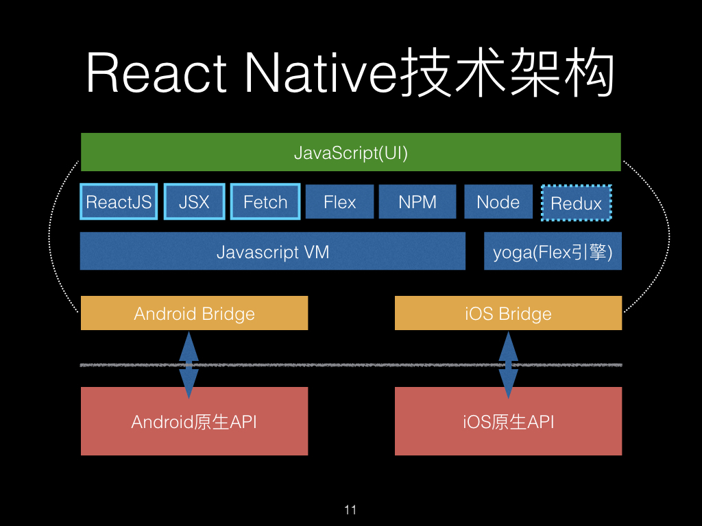

## 原理

React 监察数据变化 -> differ UI 变化 -> JSON 映射文件 -> Native 层渲染

[React Native之原理浅析](http://blog.poetries.top/2019/10/02/rn-yuanli/)

[React Native 底层原理](https://zhuanlan.zhihu.com/p/41920417)

## 优化

* bundle 拆分。拆成基础包和业务包。原生端预先加载通用包，当进入 rn 页面只加载业务包，类似 code split。

[RN拆包解决方案](https://juejin.im/post/6844904053365800968)