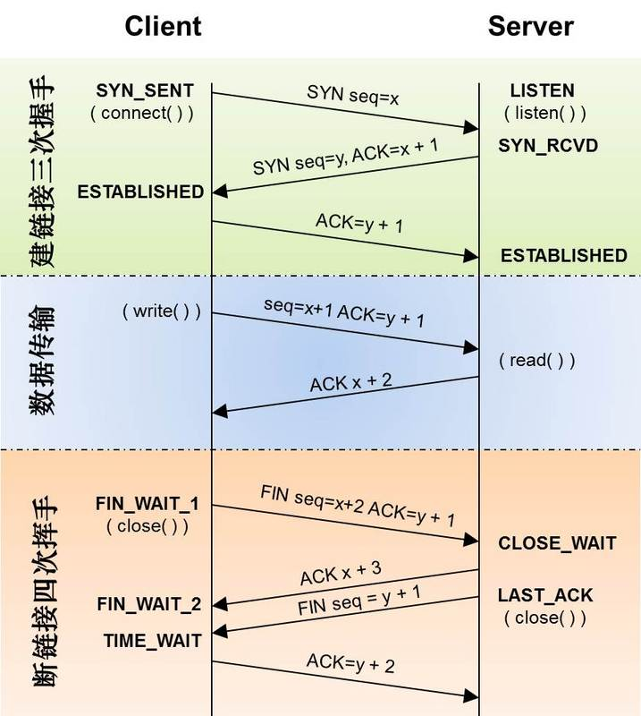

## 网络协议

七层网络模型

TCP 三次握手和四次挥手

UDP 不进行握手和挥手确认，所以传输效率比 TCP 高，实时性更好。但同时，这也决定了 UDP 是无连接的、不可靠的一种数据传输协议。

Socket（套接字） 是 TCP 对外的编程接口。

[一篇搞懂TCP、HTTP、Socket、Socket连接池](https://segmentfault.com/a/1190000014044351)

## HTTP2 新特性

* 二进制分帧，多个帧组成一个流
* 首部压缩
* 流量控制，每个 http2 流都拥有自己的公示的流量窗口，它可以限制另一端发送数据
* 多路复用，HTTP2 只维护一个 TCP 连接，多个 HTTP 请求可以复用这一个 TCP 连接，减少握手次数，避免浏览器 6~8 的连接个数限制和服务器连接个数限制。
* 请求优先级，每个 stream 都可以设置依赖 (Dependency) 和权重，按依赖树分配优先级
* 服务器推送，浏览器发送一个请求，服务器主动向浏览器推送与这个请求相关的资源，这样浏览器就不用发起后续请求

HTTP/1 的几种优化可以弃用:

合并文件、内联资源、雪碧图、域名分片对于 HTTP/2 来说是不必要的，使用 h2 尽可能将资源细粒化，文件分解地尽可能散，不用担心请求数多

[HTTP2 详解](https://juejin.im/post/5b88a4f56fb9a01a0b31a67e)

## 缓存策略

良好的缓存策略可以降低资源的重复加载提高网页的整体加载速度。通常浏览器缓存策略分为两种：

强缓存：Expires、Cache-Control

协商缓存：Last-Modified，If-Modified-Since 或 ETag、If-None-Match

优先级：Cache-Control > Expires > ETag、If-None-Match > Last-Modified，If-Modified-Since

原理：
1. 浏览器在加载资源时，根据请求头的expires和cache-control判断是否命中强缓存，是则直接从缓存读取资源，不会发请求到服务器。（200 from cache）
2. 如果没有命中强缓存，浏览器一定会发送一个请求到服务器，通过last-modified和etag验证资源是否命中协商缓存，如果命中，服务器会将这个请求返回，但是不会返回这个资源的数据，依然是从缓存中读取资源。（304）
3. 如果前面两者都没有命中，直接从服务器加载资源（200）

[浏览器缓存机制：强缓存、协商缓存](https://github.com/amandakelake/blog/issues/41)

## 状态码

301、302、307、308 的区别

|     | Permanent  | Temporary  |
|  ----  | ----  | ----  |
| Allows changing the request method from POST to GET. | 301 | 302 |
| Does not allow changing the request method from POST to GET.  | 307 | 308 |

[详解重定向（HTTP状态码301/302/303/307/408）](https://www.cnblogs.com/wuguanglin/p/redirect.html)

## HTTPS

对称加密使用一个密钥加密解密；非对称加密使用公钥私钥相互加密解密。

1. 为什么要用对称加密+非对称加密？

  仅仅用对称加密无法传输公钥给客户端；仅仅用非对称加密数据传输耗时太长。同时两者都没有单独解决中间人攻击的能力。

2. 为什么需要数字证书？

  操作系统、浏览器本身会预装 CA 机构的根证书，以及数字证书的信任链，等等这些可以保证客户端接收到的公钥是合法的公钥

3. 为什么需要数字签名？

  数字签名的过程：公钥 -> hash -> 数字摘要 -> CA 私钥 -> 数字签名

  证书中包含：数字签名、签名计算方法、证书对应域名

  防止数字证书被篡改：没有 CA 机构的私钥对篡改内容进行再加密

  防止数字证书被掉包：证书中包含了域名信息，客户端比对域名即可发现是否被掉包

[彻底搞懂HTTPS的加密机制](https://zhuanlan.zhihu.com/p/43789231)

[看完还不懂HTTPS我直播吃翔](https://zhuanlan.zhihu.com/p/25976060)

## 跨域

### 同源策略

**同源策略**是一种约定，它是浏览器最核心也最基本的安全功能，如果缺少了同源策略，浏览器很容易受到XSS、CSFR等攻击。所谓同源是指”协议+域名+端口”三者相同，即便两个不同的域名指向同一个ip地址，也非同源。

同源策略限制内容有：

* Cookie、LocalStorage、IndexedDB 等存储性内容
* DOM 节点
* AJAX 请求不能发送

但是有三个标签是允许跨域加载资源：

* ``
* `<link href=XXX>`
* `<script src=XXX>`

### 跨域方案

1. JSONP，只支持GET请求，支持老式浏览器，以及可以向不支持 CORS 的网站请求数据
2. CORS，支持所有类型的 HTTP 请求。需要在服务端返回添加头部 `Access-Control-Allow-Origin`。复杂请求的 CORS 请求如 PUT，会在正式通信之前，增加一次HTTP查询请求，称为”预检”请求,该请求是 option 方法的，通过该请求来知道服务端是否允许跨域请求。
3. 反向代理，使用 node 中间件或 nginx。同源策略是浏览器需要遵循的标准，而如果是服务器向服务器请求就无需遵循同源策略。

### 设置和获取跨域 Cookie

1、网页端中，对于跨域的 XMLHttpRequest 请求，需要设置withCredentials 属性为 true。
2、同时服务端的响应中必须携带 Access-Control-Allow-Credentials: true 首部。如果服务端的响应中未携带Access-Control-Allow-Credentials: true 首部，浏览器将不会把响应的内容返回给发送者。

另外有一点需要注意的是：规范中提到，如果 XMLHttpRequest 请求设置了withCredentials 属性，那么服务器不得设置 Access-Control-Allow-Origin的值为 * ，否则浏览器将会抛出The value of the 'Access-Control-Allow-Origin' header in the response must not be the wildcard' 错误。

### 正反向代理

正向代理中，proxy和client同属一个LAN，对server透明； 反向代理中，proxy和server同属一个LAN，对client透明。 实际上proxy在两种代理中做的事都是代为收发请求和响应，不过从结构上来看正好左右互换了下，所以把前者那种代理方式叫做正向代理，后者叫做反向代理。

[正向代理与反向代理的区别](https://www.jianshu.com/p/208c02c9dd1d)

[九种跨域方式实现原理](https://zhuanlan.zhihu.com/p/55869398)

[cookie 跨域时候要如何处理](https://www.jianshu.com/p/13d53acc124f)

## HTTP 的 GET 和 POST 区别

可以从分浏览器实现和接口实现两个角度比对，浏览器限制较多，接口限制较少，但接口有一些影响力较大的接口规范如 REST，也对两者做出一些规则约定。

* GET 一般用于获取服务器资源；POST 一般用于修改服务器资源
* 浏览器中，GET 一般被设计为无副作用，幂等；POST 一般是有副作用
* 浏览器中，GET 可缓存，POST 不可以

[GET 和 POST 到底有什么区别？](https://www.zhihu.com/question/28586791/answer/767316172)