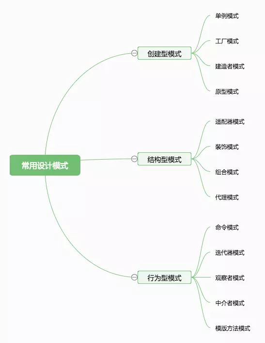
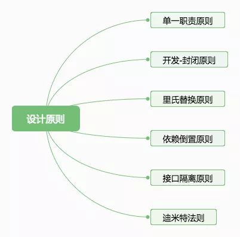

## 系统设计原则

* 模块化
  * 高内聚（Cohesion）
  * 低耦合（Coupling）
* 解耦
  * 分层设计
  * 单向依赖
  * 服务抽象
* 可插拔设计
* 配置驱动，插件化/中间件化

## 什么是设计模式

维基百科定义：

> 在软件工程中，设计模式（design pattern）是对软件设计中普遍存在（反复出现）的各种问题，所提出的解决方案。这个术语是由埃里希·伽玛（Erich Gamma）等人在1990年代从建筑设计领域引入到计算机科学的。

> 设计模式并不直接用来完成代码的编写，而是描述在各种不同情况下，要怎么解决问题的一种方案。面向对象设计模式通常以类别或对象来描述其中的关系和相互作用，但不涉及用来完成应用程序的特定类别或对象。设计模式能使不稳定依赖于相对稳定、具体依赖于相对抽象，避免会引起麻烦的紧耦合，以增强软件设计面对并适应变化的能力。

设计模式是一套被反复使用，思想成熟，经过分类和无数实战设计经验的总结。使用设计模式是为了让系统代码可重用，可扩展，可解耦，更容易被人理解且能保证代码可靠性。设计模式使代码开发真正工程化；设计模式是软件工程的基石脉络，如同大厦的结构一样。只有夯实地基搭好结构，才能盖出坚壮的大楼。也是我们迈向高级开发人员必经的一步。

《Design Patterns: Elements of Reusable Object-Oriented Software》（中文名《设计模式》），提出了 23 种设计模式。大概有一半在日常编程中会经常用到。

## 23 种设计模式

1. 抽象工厂模式（ABSTRACT FACTORY）
2. 建造模式（BUILDER）
3. 工厂方法模式（FACTORY METHOD）
4. 原始模型模式（PROTOTYPE）
5. 单例模式（SINGLETON）
6. 适配器模式（ADAPTER）
7. 桥梁模式（BRIDGE）
8. 合成模式（COMPOSITE）
9. 装饰模式（DECORATOR）
10. 门面模式（FACADE）
11. 享元模式（FLYWEIGHT）
12. 代理模式（PROXY）
13. 责任链模式（CHAIN OF RESPONSIBILITY）
14. 命令模式（COMMAND）
15. 解释器模式（INTERPRETER）
16. 迭代子模式（ITERATOR）
17. 调停者模式（MEDIATOR）
18. 备忘录模式（MEMENTO）
19. 观察者模式（OBSERVER）
20. 状态模式（STATE）
21. 策略模式（STRATEGY）
22. 模板方法模式（TEMPLATE METHOD）
23. 访问者模式（VISITOR）

内容繁多，为了便于初步理解，可以参见关于 23 种设计模式的[有趣见解](https://baike.baidu.com/item/GoF#4)

如果将常见的设计模式根据类型做一个分类，可以这样划分：



## 设计模式六大原则



快速了解，可见[这里](https://www.jianshu.com/p/807bc228dbc2)

## 常见设计模式的应用

### 单例模式

实现单例模式的核心就是保证一个类仅有一个实例，那么意思就是当创建一个对象时，我们需要判断下之前有没有创建过该实例，如果创建过则返回之前创建的实例，否则新建。

应用例子：

一个页面中的模态框只有一个，每次打开与关闭的都应该是同一个，而不是重复新建

```javascript
var createSingleInstance = function(fn) {
  var instance = null;
  return function() {
    if (!instance) {
      instance = fn.apply(this, arguments);
    }
    return instance;
  }
};

var createModal = function() {
  var modal = docuemnt.createElement('div');
  //...
  modal.style.display = 'none';
  document.getElementById('container').append(modal);
  return modal;
};

var modal = createSingleInstance(createModal);
```

### 工厂模式

工厂模式是由一个方法来决定到底要创建哪个类的实例, 而这些实例经常都拥有相同的接口。这种模式主要用在所实例化的类型在编译期并不能确定，而是在执行期决定的情况。说的通俗点，就像公司茶水间的饮料机，要咖啡还是牛奶取决于你按哪个按钮。

应用例子：`new` 关键字


### 观察者模式

定义了对象与其他对象之间的依赖关系，当某个对象发生改变的时候，所有依赖到这个对象的地方都会被通知。

应用例子：knockout.js 中的 ko.compute、vue 中的 computed 函数、React 的 redux 其实就是这个模式的实践。实现观察者模式的核心就是我们需要有一个变量来保存所有的依赖，一个listen函数用于向变量中添加依赖，一个trigger函数用于触发通知。

```
var observal = {
  eventObj: {},
  listen: function(key, fn) {
    this.eventObj[key] = this.eventObj[key] || [];
    this.eventObj[key].push(fn);
  },
  trigger: function(key) {
    var eventList = this.eventObj[key];
    if (!eventList || eventList.length < 1) {
      return;
    }
    var length = eventList.length;
    for (var i = 0; i < length; i++) {
      var event = eventList[i];
      event.apply(this, arguments);
    }
  }
};

//定义要监听的事件
observal.listen('command1', function() {
  console.log('黑夜给了我夜色的眼睛~');
});
observal.listen('command1', function() {
  console.log('我却用它寻找光明~');
});
observal.listen('command2', function() {
  console.log('一花一世界~');
});
observal.listen('command2', function() {
  console.log('一码一人生~');
});

//触发某个监听的事件
observal.trigger('command1');//黑夜给了我夜色的眼睛~ 我却用它寻找光明~
observal.trigger('command2');//一花一世界~ 一码一人生~
```

### 适配器模式

适配器模式是将一个类（对象）的接口（方法或属性）转化成客户希望的另外一个接口（方法或属性），适配器模式使得原本由于接口不兼容而不能一起工作的那些类（对象）可以一起工作。

应用例子：vue 里的 filter

### 代理模式

代理模式的定义是把对一个对象的访问, 交给另一个代理对象来操作。很多操作封装都可以归类为这个模式。

应用例子：众多封装 xhr 的请求库。

### 策略模式

策略模式的意义是定义一系列的算法，把它们一个个封装起来，并且使它们可相互替换。

应用例子：表单验证

```
// 把每种验证规则都用策略模式单独的封装起来。需要哪种验证的时候只需要提供这个策略的名字
nameInput.addValidata({
   notNull: true,
   dirtyWords: true,
   maxLength: 30
})
// 而notNull，maxLength等方法只需要统一的返回true或者false，来表示是否通过了验证。
validataList = {
  notNull: function( value ){
     return value !== '';
  },
  maxLength: function( value, maxLen ){
     return value.length() > maxLen;
  }
}
```

### 模版方法模式

模式方法是预先定义一组算法，先把算法的不变部分抽象到父类，再将另外一些可变的步骤延迟到子类去实现。听起来有点像工厂模式( 非前面说过的简单工厂模式 ).最大的区别是,工厂模式的意图是根据子类的实现最终获得一种对象. 而模版方法模式着重于父类对子类的控制。

应用举例：所有游戏有的生命周期，登录、游戏、退出

```
var gameCenter = function(){
}
gameCenter.ptototype.init = function(){
  this.login();
  this.gameStart();
  this.end();
}
gameCenter.prototype.login= function(){
   //do something
}
gameCenter.prototype.gameStart= function(){
   //空函数, 留给子类去重写
}
gameCenter.prototype.end= function(){
  alert ( "欢迎下次再来玩" );
}

var 斗地主 = function(){
}
斗地主.prototype = gameCenter.prototype;  //继承
斗地主.prototype.gameStart = function(){
  //do something
}
(new 斗地主).init();
```

### 中介者模式

中介者对象可以让各个对象之间不需要显示的相互引用，从而使其耦合松散，而且可以独立的改变它们之间的交互。使用中介者模式可以把复杂的多对多关系, 变成了2个相对简单的1对多关系。

### 组合模式

组合模式又叫部分-整体模式，它将所有对象组合成树形结构。使得用户只需要操作最上层的接口，就可以对所有成员做相同的操作。

应用举例

```
// 繁琐的表单验证
if ( nameField.validata() && idCard.validata() && email.validata() && phone.validata() ){
   alert ( "验证OK" );
}

// 组合模式的表单验证
form.validata = function(){
  forEach( fields, function( index, field ){
    if ( field.validata() === false  ){
       return false;
    }
  })
  return true;
}
```

### 备忘录模式

备忘录模式在js中经常用于数据缓存. 比如一个分页控件, 从服务器获得某一页的数据后可以存入缓存。以后再翻回这一页的时候，可以直接使用缓存里的数据而无需再次请求服务器。

```
var Page = function(){
   var page = 1,
      cache = {},
      data;
   return function( page ){
      if ( cache[ page ] ){
               data =  cache[ page ];
               render( data );
      }else{
               Ajax.send( 'cgi.xx.com/xxx', function( data ){
                   cache[ page ] = data;
                   render( data );
               })
      }
    }
}()
```

### 职责链模式

职责链模式是一个对象A向另一个对象B发起请求，如果B不处理，可以把请求转给C，如果C不处理，又可以把请求转给D。一直到有一个对象愿意处理这个请求为止。

应用举例：JS 事件冒泡

### 享元模式

享元模式主要用来减少程序所需的对象个数。

应用举例：Canvas 的渲染缓冲、长列表的展示（只显示视线内的元素）。

### 状态模式

状态模式主要可以用于这种场景
* 1、一个对象的行为取决于它的状态
* 2、一个操作中含有庞大的条件分支语句


## 参考资料
* [常用的Javascript设计模式
](http://blog.jobbole.com/29454/)
* [使用合适的设计模式一步步优化前端代码](https://juejin.im/post/59f29fda518825549f7260c9)
* [javascript 设计模式](http://www.cnblogs.com/Darren_code/archive/2011/08/31/JavascripDesignPatterns.html)
* [JavaScript Patterns Github Repo](https://github.com/shichuan/javascript-patterns)
* [Learning JavaScript Design Patterns](https://addyosmani.com/resources/essentialjsdesignpatterns/book/)
