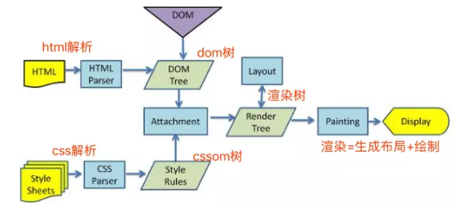
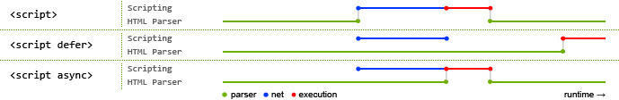

## 浏览器进程

1. brower 进程（主进程）
    * 负责浏览器的页面展示，与用户交互。如前进，后退
    * 页面的前进，后退
    * 负责页面的管理，创建和销毁其他进程
2. GPU 进程：3D 渲染
3. 插件进程：每种类型的插件对应一个进程，仅当使用该插件时才能创建
4. 浏览器渲染进程（浏览器内核）
    * GUI 渲染线程：DOM 解析， CSS 解析，生成渲染树
    * js 引擎线程：执行 Js 代码
    * 事件触发：管理着一个任务队列
    * 异步 HTTP 请求线程
    * 定时触发器线程

可以看到 js 引擎是浏览器渲染进程的一个线程。而 js 线程和渲染线程是互斥的，所以当 setInterval 密度足够高时，可能会导致画面与数据不一致。解决办法是 requestAnimationFrame，他在每次浏览器重绘之前调用 js 函数。

requestAnimationFrame 基本配合递归调用来实现。

```js
var start = null;
var element = document.getElementById('SomeElementYouWantToAnimate');
element.style.position = 'absolute';

function step(timestamp) {
  if (!start) start = timestamp;
  var progress = timestamp - start;
  element.style.left = Math.min(progress / 10, 200) + 'px';
  if (progress < 2000) {
    window.requestAnimationFrame(step);
  }
}

window.requestAnimationFrame(step);
```

[setTimeout和requestAnimationFrame](https://juejin.im/post/5e621f5fe51d452700567c32)

## 渲染过程



### 浏览器工作流程

输入 URL 到页面呈现：

1. DNS 解析
2. TCP 连接，三次握手
3. 发送 HTTP 请求
4. 服务器处理请求并返回 HTTP 报文
5. 浏览器解析渲染页面：构建 DOM Tree -> 构建 CSS Rule Tree -> 构建 Rendering Tree -> 布局 -> 绘制
6. TCP 链接关闭，四次挥手

[前端经典面试题: 从输入URL到页面加载发生了什么？](https://segmentfault.com/a/1190000006879700)

### JS 阻塞



1. 因为 JavaScript 不只是可以改 DOM，还可以更改 CSSOM。而不完整的CSSOM是无法使用的，所以存在阻塞的 CSS 资源时，浏览器会延迟 JavaScript 的执行和 DOM 构建。因此引入顺序上 CSS 应资源先于 JavaScript 资源。构建或执行顺序 CSSOM -> JS -> DOM
2. 加 async 或 defer 属性都可以做到下载阶段不阻塞 DOM Tree 的构建，但 defer 可以做到执行阶段也不阻塞。因为 defer 会在 DOMContentLoaded 事件之后才执行 js。什么时候用defer，什么时候用async呢？一般来说，两者之间的选择则是看脚本之间是否有依赖关系，有依赖的话应当要保证执行顺序，应当使用defer；没有依赖的话使用async，同时使用的话defer失效。

这里要简要说明一下`window.DOMContentLoaded`和`window.onload`这两个事件的区别，前者是在DOM解析完毕之后触发，这时候DOM解析完毕，JavaScript可以获取到DOM引用，但是页面中的一些资源比如图片、视频等还没有加载完，作用同jQuery中的ready事件。后者则是页面完全加载完毕，包括各种资源。

### 重绘和回流

重绘：当render tree中的一些元素需要更新属性，而这些属性只是影响元素的外观、风格，而不会影响布局的，比如color、background-color、visibility。

回流：当render tree中的一部分(或全部)因为元素的规模尺寸、布局等改变而需要重新构建

回流必定会发生重绘，重绘不一定会引发回流。

[深入浅出浏览器渲染原理](https://blog.fundebug.com/2019/01/03/understand-browser-rendering/)

[浏览器的渲染：过程与原理](https://juejin.im/entry/59e1d31f51882578c3411c77)

[浏览器的回流与重绘 (Reflow & Repaint)](https://juejin.im/post/6844903569087266823)