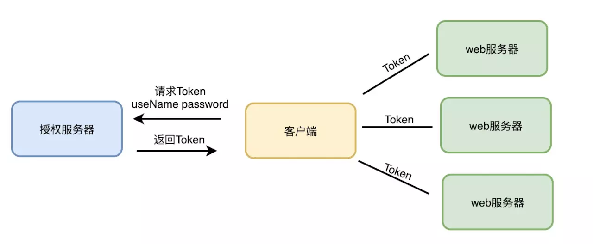

## DOM 和 BOM

DOM（document object model）：文档对象模型，提供操作页面元素的方法和属性

BOM（browser object model）；浏览器对象模型，提供一些属性和方法可以操作浏览器

[最全的DOM和BOM的解释分析](https://juejin.im/post/5d7677b06fb9a06afd662d20)

## 存储机制

| 特性	| Cookie | localStorage | sessionStorage |
|  ----  | ----  | ----  | ----  |
| 数据的生命期	| 一般由服务器生成，可设置失效时间。如果在浏览器端生成Cookie，默认是关闭浏览器后失效	| 除非被清除，否则永久保存	| 仅在当前会话下有效，关闭页面或浏览器后被清除 |
| 存放数据大小	| 4K左右	| 一般为5MB | 一般为5MB |
| 与服务器端通信	| 每次都会携带在HTTP头中，如果使用cookie保存过多数据会带来性能问题	| 仅在客户端（即浏览器）中保存，不参与和服务器的通信 | 仅在客户端（即浏览器）中保存，不参与和服务器的通信 |
| 易用性	| 需要程序员自己封装，源生的Cookie接口不友好	| 源生接口可以接受，亦可再次封装来对Object和Array有更好的支持 | 源生接口可以接受，亦可再次封装来对Object和Array有更好的支持 |

[详解 Cookie，Session，Token](https://juejin.im/post/5d01f82cf265da1b67210869)

### 单点登录的实现

使用 token，成熟方案是 JWT（JSON Web Token），解决 session 无法共享登录状态到子系统的问题。

## window.performance

在开发环境下，其实我们自己打开 Chrome 的开发者工具，切换到网络面板，就能很详细的看到网页性能相关的数据。但当我们需要统计分析用户打开我们网页时的性能如何时，我们将 performance 原始信息或通过简单计算后的信息 (如上面写到的 getPerformanceTiming()  和 getEntryTiming()) 上传到服务器，配合其他信息（如 HTTP 请求头信息），就可以监控到用户端的表现数据。

[初探 performance – 监控网页与程序性能](http://www.alloyteam.com/2015/09/explore-performance/)