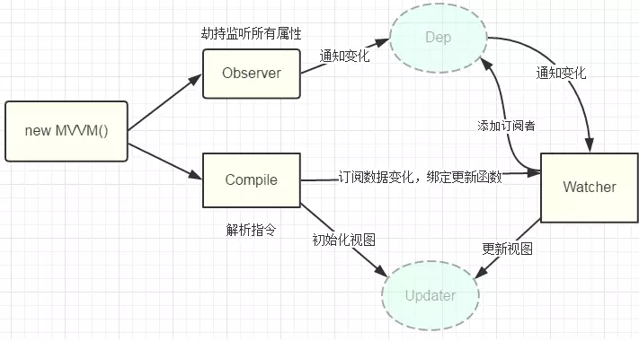

## MVC MVVM 的区别

MVVM模式的优点:
1. 低耦合: View可以独立于Model变化和修改,一个ViewModel可以绑定到不同的View上,当View变化的时候Model可以不变,当Model变化的时候View也可以不变。
2. 可重用性: 可以把一些视图逻辑放在一个ViewModel里面,让很多View重用这段视图逻辑。
3. MVVM v 和 vm 是双向绑定，所以免除了不必要的 dom 操作

[MVVM与MVC设计模式区别](https://juejin.im/post/5ceb4a2ef265da1b6f435291)

[MVC，MVP 和 MVVM 的图示](https://www.ruanyifeng.com/blog/2015/02/mvcmvp_mvvm.html)

## MVVM 的实现

可以结合 Object.defineProperty 的数据劫持方案和发布订阅模式实现，MVVM 各模块职责：

* MVVM: Vue 实例初始化，调用 Observer 数据劫持，调用 Compiler 解析模板；
* Observer: 劫持 data 全部属性，定义 setter 、getter，添加和通知订阅者；
* Compiler: 解析模板初始化视图，收集模板中的数据依赖，创建订阅者订阅变化，绑定更新函数；
* Dep：订阅中心，提供添加、移除、通知订阅的接口；
* Watcher: data 属性的订阅者，收到变化通知后调用更新函数更新视图。

[Vue MVVM 实现（defineProperty 篇）](https://jancat.github.io/post/2019/vue-mvvm/)

[模拟 Vue 手写一个 MVVM](https://juejin.im/post/5b578682f265da0f504a5c6d)

## Differ 算法

不同框架对于 DOM Diff 的理解并不完全一致，但有一点可以达成共识：由于 DOM 本身是树形（Tree）结构，不同层级之间的节点（Node）没有必要对比，因为这可能会带来 O(N³) 的计算复杂度，很可能还不如直接操作 Real DOM 来的快。因此，狭义的 DOM Diff 算法，一般指的是同一层级兄弟节点的范围之内。

* tree 级别，忽略跨层级，只比对同级
* component 级别，如果是相同组件，比对 Virtual DOM；如果已经替换了别的组件，则直接替换整个组件下所有子节点
* element 级别，对于同一层级的一组子节点，它们可以通过唯一 id 即 key 值进行区分。这里具体移动、插入、删除的逻辑，是 React 和 Vue 的 diff 真正区别。vue 使用了头部尾部双指针比对，用空间换时间，执行上会更快。

[虚拟DOM与DIFF算法学习](https://segmentfault.com/a/1190000015820273)

[浅谈 React/Vue/Inferno 在 DOM Diff 算法上的异同](https://www.imooc.com/article/295545)

[传统diff、react优化diff、vue优化diff](https://www.jianshu.com/p/398e63dc1969)

## AOP

面向侧面的程序设计（aspect-oriented programming，AOP，又译作面向方面的程序设计、观点导向编程、剖面导向程序设计）是计算机科学中的一个术语，指一种程序设计范型。侧面的概念源于对面向对象的程序设计的改进，解决横切关注点（Cross-Cutting Concerns）的问题，但并不只限于此，它还可以用来改进传统的函数。

AOP 是针对业务处理过程中的切面(即非业务逻辑部分，例如错误处理，埋点，日志等)进行提取。

Mixins、HOC（高阶组件）、React Hooks 这些都是 AOP 的具体实现。

## 路由

HashRouter：
* 原理是使用 onhashchange
* 兼容性高

BrowserRouter：
* 更美观，符合标准
* 可以使用锚点定位
* 可以使用浏览器 history API
* 会带到 http 请求头，后端可以根据 url 地址判断 404

在微信中分享到朋友圈或好友时，分享出去的路由被破坏，打开分享的链接，路由中的“#”会被去掉并追加？fromTimeline之类的后缀参数，这就造成了分享出去的链接只能进入首页，无法正常跳转到其他路由。

[hash模式下微信分享后打开首页，三种完美解决方案](https://juejin.im/post/5e536fe2e51d4526ea7ef2b2)