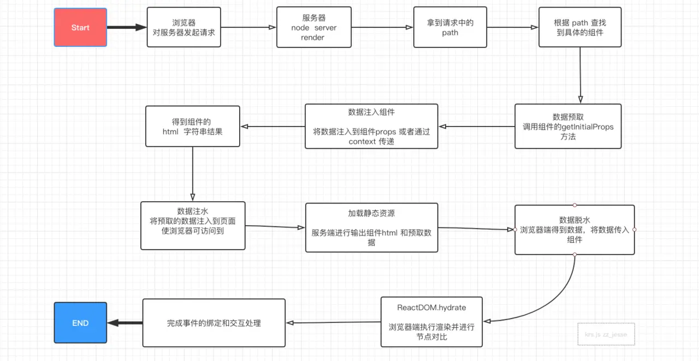

## 解决了什么问题

* 优化 SPA 首屏渲染
* 优化 SPA SEO 的问题

## 流程


## 实现

同构

* 路由同构：双端使用同一套路由规则，node server 通过 req url path 进行组件的查找，得到需要渲染的组件。关键代码
  ```
    // 路径匹配
    import { matchRoutes } from "react-router-config";

    //查找组件
    const branch =  matchRoutes(routes,url);
    
    //得到组件
    const Component = branch[0].route.component;

    //将组件渲染为 html 字符串
    const html = renderToString(<Component data={data}/>);

    res.end(html);
  ```
* 数据同构：node server 获取到组件后，调用组件的静态方法获取数据
  ```
    //数据预取
    const data = Component.getInitialProps(branch[0].match.params);

    //传入数据，渲染组件为 html 字符串
    const html = renderToString(<Component data={data}/>);

    res.end(html);
  ```
* 渲染同构：服务端和浏览器端，首屏 html 和数据必须两者一致，否则会出现闪烁。服务端已经通过 `renderToString` 拿到组件 html，通过组件静态方法拿到初始数据，只差把数据传给浏览器端这一步。通过服务器端注水，浏览器端脱水，可实现数据同步，`ReactDOM.hydrate` 比对渲染差异，加载事件处理，完成 SPA 构建。

## 细节

* 服务端转化组件 html 时，添加对 css 的过滤
* TDK 个性化支持
* 服务端对 window 对象的使用（fake window）
* 动态路由？

[一文吃透 React SSR 服务端渲染和同构原理](https://juejin.im/post/5d7deef6e51d453bb13b66cd)

[React SSR重构踩坑记录](https://juejin.im/post/5bc43a30e51d450e46288fcf)
