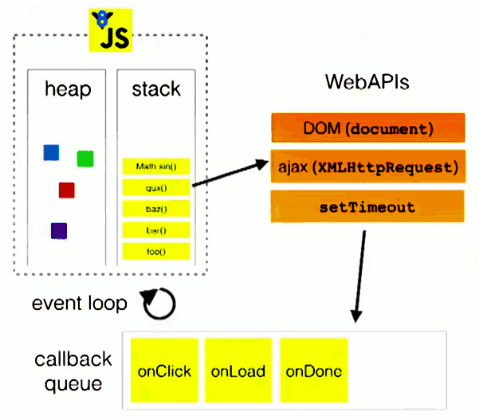
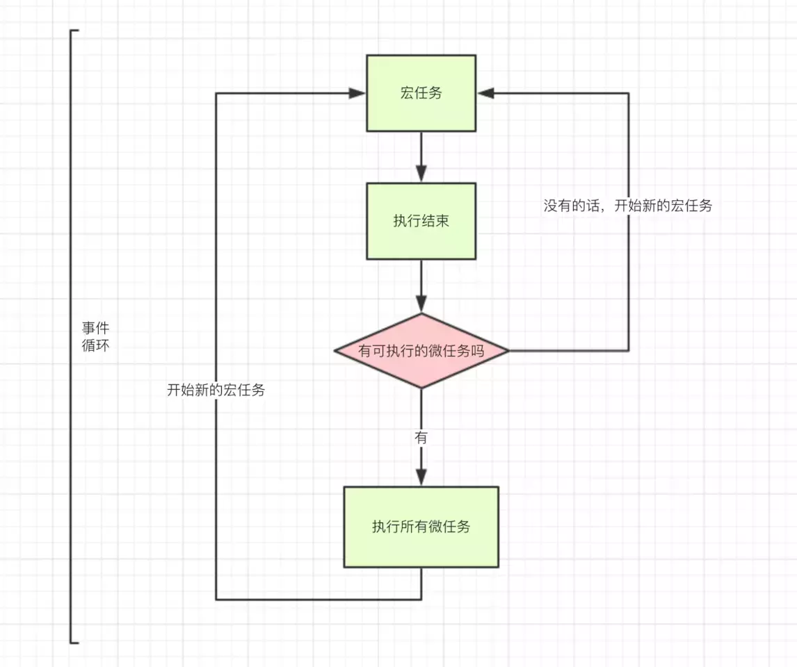

## 宏任务和微任务

JS 执行过程

微任务和宏任务皆为异步任务，它们都属于一个队列。宏任务和微任务执行完成后都会判断是否还有微任务，有的话执行微任务，没有就执行宏任务，如此循坏。

[JS事件循环机制（event loop）之宏任务/微任务](https://juejin.im/post/5b498d245188251b193d4059)

[微任务、宏任务与Event-Loop](https://juejin.im/post/5b73d7a6518825610072b42b)