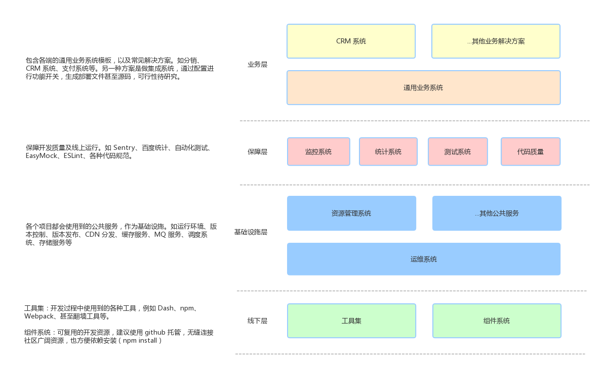

## 唯厘技术体系

### 概览

### 前端通用业务系统

* 基础库
  * 第三方基础库：lodash
  * 第三方功能库：axios、Modernizr、Sentry、GA、微信 JSSDK
  * JS 框架：jquery、三大 MVVM 框架
  * UI 框架：基于 JS 框架的样式框架，AntDesign、Vuetify、Bootstrap
* 公共库
  * 公共功能库：功能性封装的组件，鉴权、请求、支付、桥接库、i18n 等
  * 公共样式库：样式变量、mixin、公共类