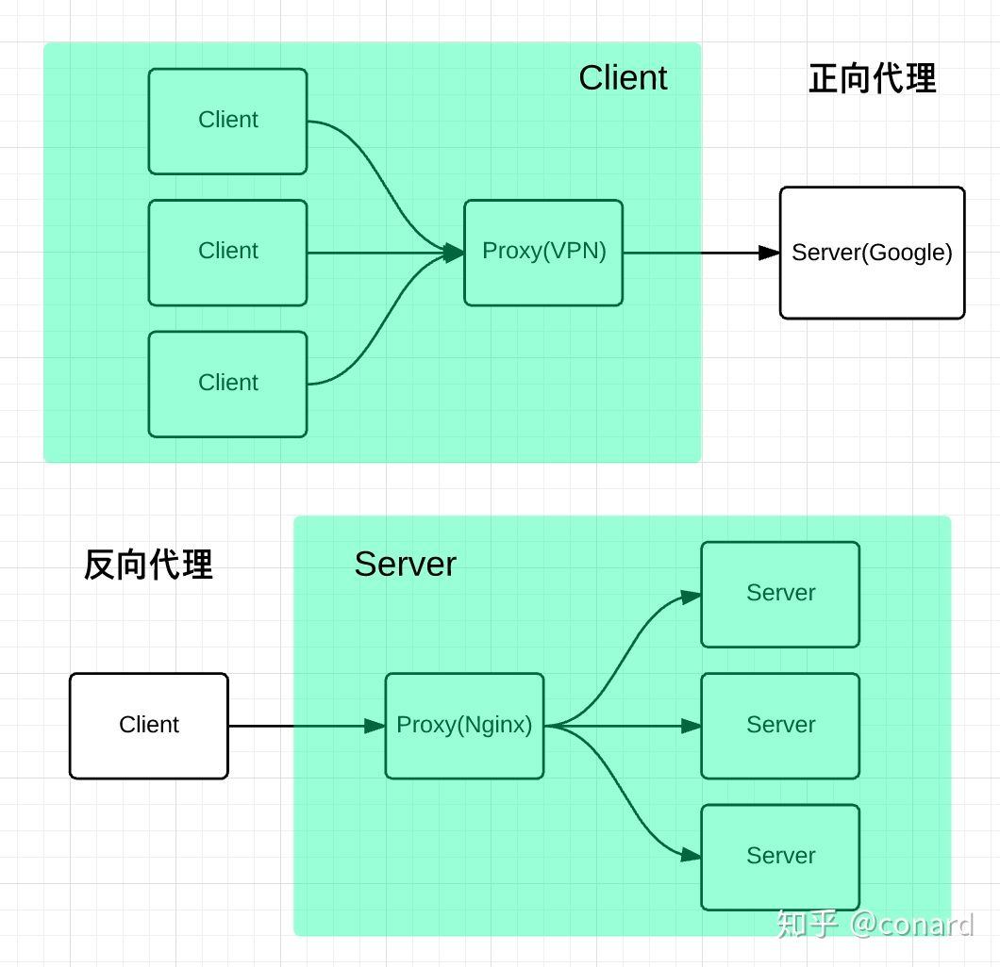
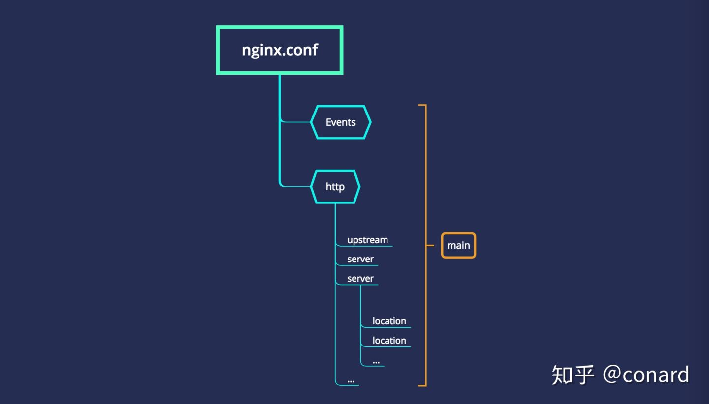

## 正向代理、反向代理



## nginx 配置结构



[前端开发者必备的nginx知识](https://zhuanlan.zhihu.com/p/65393365)

nginx可配置的缓存又有2种：

1）客户端的缓存(一般指浏览器的缓存)。

2）服务端的缓存(使用proxy-cache实现的)。

```
expires 1h; // 强缓存
add_header Cache-Control max-age=360000;  // 强缓存
add_header Cache-Control max-age=no-cache; // 不用强缓存，降级为判断文档 Last-Modified，即协商缓存
```

[nginx缓存配置及开启gzip压缩](https://www.cnblogs.com/tugenhua0707/p/10841267.html)